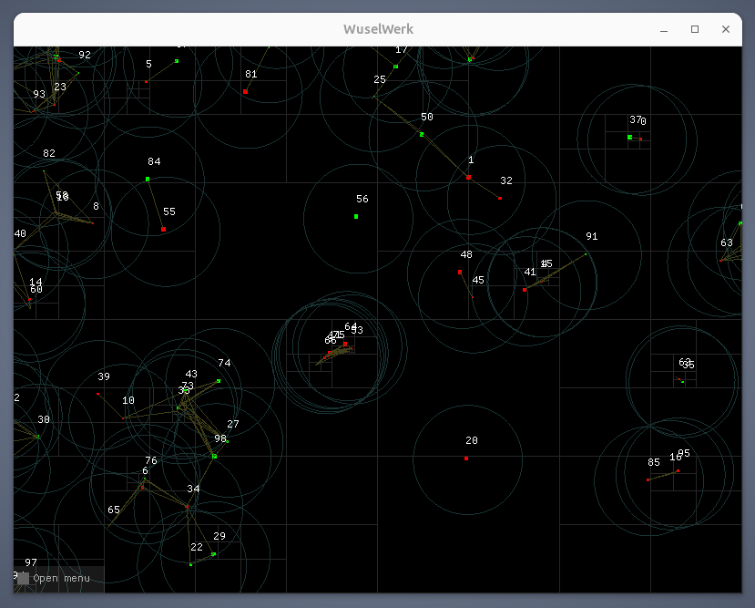

# Wuselwerk

W.I.P. Sandbox simulation using ~~[SDL](https://www.libsdl.org/)~~ OpenGL/GLFW



---

## Getting Started

### Install

```bash
sudo apt-get install libglfw3-dev freeglut3-dev libglew-dev
```

### Build

```
make clean && make
./wusel
```

### Usage

```bash
./wusel -h
```
---

## Documentation

 * [OpenGL](https://docs.gl/)
 * [GLFW](https://www.glfw.org/docs/latest/)

---

## Acknowledgements

 * [OpenGL](https://www.opengl.org/)
